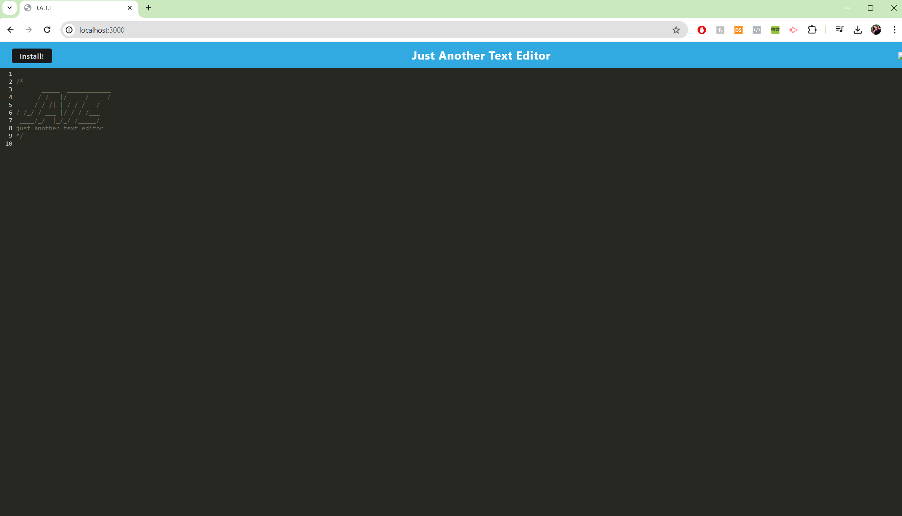

# Word Editor


## Description

A single-page text-editor that can be installed as a Progressive Web Application offline.

Deployed application: https://mod-19-word-edit.onrender.com

## Table of Contents

- [Screenshot](#screenshot)
- [Usage](#usage)
- [License](#license)
- [Questions](#questions)

## Screenshot



## Usage

Run from the command line:

```
npm install
```
Run to start the server: 

```
npm run build
```

## License

The project is under MIT License.

## Questions

If you have any questions regarding the project, please, feel free to contact me:

- GitHub: [ninabuscemi](https://github.com/ninabuscemi)
